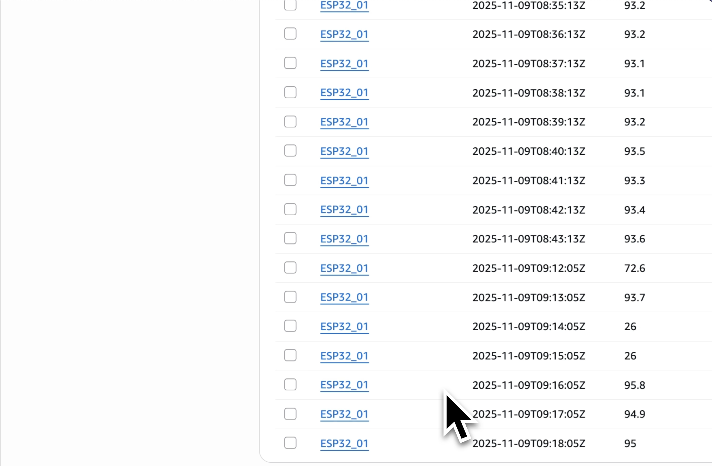
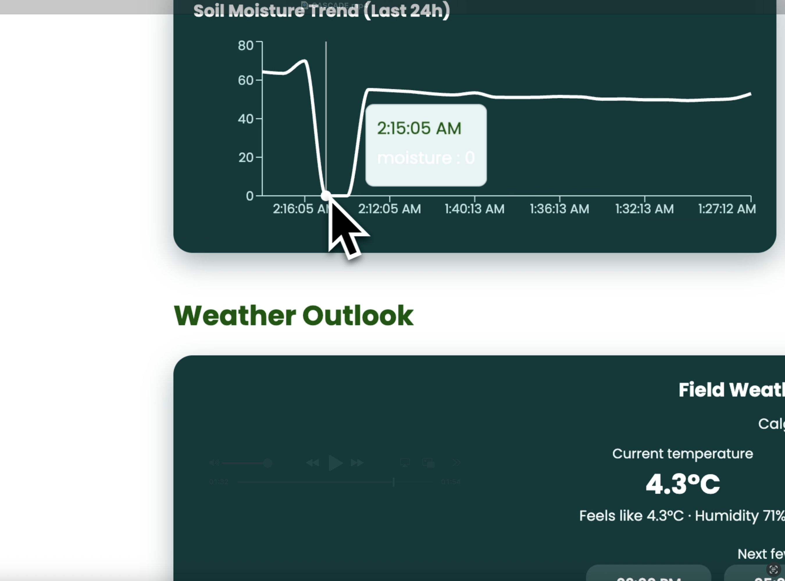

# Cascade Agriculture Monitoring Platform

An end‑to‑end field telemetry stack that combines ESP32‑based sensing hardware, AWS IoT + DynamoDB ingestion, a Calgary‑aware weather layer, and Gemini‑generated agronomy insights. The system streams real-time soil moisture and motion data from the field, stores it in DynamoDB, visualises the readings on a Vite/React dashboard, and enriches the experience with OpenWeather forecasts and Gemini risk assessments. 

---

## Table of Contents

1. [Project Overview](#project-overview)  
2. [Architecture](#architecture)  
3. [Features](#features)  
4. [Hardware](#hardware)  
5. [Software Stack](#software-stack)  
6. [Local Development](#local-development)  
7. [Environment Variables](#environment-variables)  
8. [AWS Deployment (Amplify)](#aws-deployment-amplify)   
9. [IoT & Data Ingestion](#iot--data-ingestion)  
10. [Troubleshooting](#troubleshooting)  
11. [Snapshots](#snapshots)

---

## Project Overview

- **Goal:** Provide actionable, real-time farm intelligence by merging live soil data with contextual weather forecasts and AI-generated guidance.  
- **Hybrid nature:** The project spans **hardware** (ESP32 + moisture + PIR sensor) and **software** (React dashboard + AWS cloud services + AI integrations).  
- **Primary location:** Weather defaults to **Calgary, Alberta** while allowing overrides through environment variables.

> 🔗 **Live Frontend:** [Cascade Dashboard](http://cascade-frontend-393344834379.s3-website.us-east-2.amazonaws.com)  
> 🎥 **Demo Video:** [Watch the walkthrough](https://youtube.com/shorts/QNphY0bLslk?si=LLD4VrCa_xxE65Fj)

---

## Architecture

```
ESP32 Sensors  -->  AWS IoT Core  -->  DynamoDB  -->  React Dashboard
                                  ↘
                                   Gemini AI (insights)
                                   OpenWeather (forecast)
```

  
_Figure 1: DynamoDB items captured from the ESP32 feed._

1. **Hardware:** ESP32 reads soil moisture (capacitive probe) and an infrared motion sensor, then pushes JSON payloads.  
2. **Cloud ingestion:** AWS IoT Core routes messages into DynamoDB `CascadeReadings`.  
3. **Frontend:** `cascade/` Vite React app fetches live readings, weather (OpenWeather API), and uses Gemini for contextual insights.  
4. **Amplify hosting:** The dashboard is deployed globally via AWS Amplify, rebuilt on each `main` push.

---

## Features

- Real-time soil moisture timeline with smoothing and anomaly detection.  
- Environmental panel combining current Calgary weather, short-term forecast, and risk cues (frost/heat/wind/rain).  
- Gemini 2.0 Flash insights that fuse sensor + forecast data into 4 actionable recommendations.  
- DynamoDB-backed history with React Query caching and fallbacks.  
- Responsive UI with gradient insight cards and tooltip rollovers.

  
_Figure 3: ESP32 field rig with infrared and moisture sensors._

---

## Hardware

| Component | Purpose |
|-----------|---------|
| ESP32 Dev Kit | Wi-Fi enabled microcontroller, streams sensor data over MQTT/HTTPS |
| Capacitive Soil Moisture Sensor | Measures volumetric water content |
| PIR Infrared Motion Sensor | Detects movement/field activity |
| Breadboard + Dupont wires | Rapid prototyping connections |
| USB Data Cable | Power + serial flashing |

> ⚙️ Flash the ESP32 with the supplied Arduino sketch (see `arduino/` folder). The payload includes `device_id`, `moisture`, `timestamp`, and optional PIR readings.

  
_Figure 2: Dashboard moisture trend visualising recorded soil moisture._

---

## Software Stack

- **Frontend:** React 19 + Vite, TanStack Query, Recharts, Lucide icons.  
- **AI:** Gemini API (`gemini-2.0-flash`).  
- **Weather:** OpenWeather `/weather` + `/forecast` endpoints.  
- **Cloud:** AWS IoT Core, DynamoDB, Amplify Hosting.  
- **Tooling:** ESLint 9, Vite build pipeline, Amplify CI via `amplify.yml`.

---

## Local Development

```bash
git clone https://github.com/BilalA5/Cascade.git
cd Cascade/cascade
npm install
cp .env.example .env   # then edit with your keys
npm run dev             # http://localhost:3003 (port is fixed in vite.config.js)
```

> The dev server is pinned to port **3003**. Stop conflicting processes or adjust in `vite.config.js`.

---

## Environment Variables

Create `cascade/.env` with:

```
VITE_AWS_REGION=us-east-2
VITE_AWS_ACCESS_KEY_ID=...
VITE_AWS_SECRET_ACCESS_KEY=...
VITE_DYNAMODB_TABLE_NAME=CascadeReadings

VITE_GEMINI_API_KEY=...
VITE_OPENWEATHER_API_KEY=...
VITE_SITE_LATITUDE=51.0447
VITE_SITE_LONGITUDE=-114.0719
VITE_GEMINI_MODEL=gemini-2.0-flash
```

Restart the dev server after edits so Vite reloads the env vars. For production, mirror the same keys in Amplify **App settings → Environment variables**.

---

## AWS Deployment (Amplify)

1. Push `main` to GitHub (`git push origin main`).  
2. In Amplify console, connect the repo (branch `main`).  
3. Ensure the build settings use the bundled `amplify.yml` which runs:
   ```yaml
   preBuild:
     commands:
       - npm ci --prefix cascade
   build:
     commands:
       - npm run build --prefix cascade
   artifacts:
     baseDirectory: cascade/dist
   ```
4. Add the environment variables (see above) in Amplify.  
5. Deploy—Amplify will build and serve the app at `https://<app-id>.amplifyapp.com/`.  
6. Optionally attach a custom domain under **Domain management**.

---

## IoT & Data Ingestion

- Provision an AWS IoT thing for the ESP32 and attach a policy allowing `iot:Publish`.  
- Use MQTT topics (e.g., `cascade/readings`) to forward payloads to Lambda/DynamoDB via IoT rules.  
- The React app reads from DynamoDB (through a REST/Lambda proxy or pre-processed API), expecting fields:
  ```json
  {
    "device_id": "ESP32_01",
    "timestamp": "2025-11-09T09:12:05Z",
    "moisture": 72.6,
    "pest_score": 0.34
  }
  

---

## Troubleshooting

- **Amplify build fails with “Missing script: build”**  
  Ensure the latest `amplify.yml` is committed so Amplify uses the `cascade` subdirectory.

- **“Missing OpenWeather API key” in UI**  
  Confirm `VITE_OPENWEATHER_API_KEY` is in `cascade/.env` (no spaces) and the dev server restarted.

- **Gemini fallback message**  
  The Gemini API returns an error (bad key or quota). Check the key and the model name (`gemini-2.0-flash`).

- **Charts show zeros**  
  Verify DynamoDB has current readings and the ingestion job is populating `moisture` values.

---

## Snapshots

| Figure | Location in README | File |
|--------|--------------------|------|
| Figure 1 | After Architecture diagram | `cascade/docs/images/dynamodb-readings.png` |
| Figure 2 | After Features list | `cascade/docs/images/moisture-trend.png` |
| Figure 3 | After Hardware table | `cascade/docs/images/esp32-hardware.png` |

---

## Collaborators

- Bilal Ahmed
- Haris Naveed
- Shayan Shaikh
- Saifullah Asad

---

## License

MIT License. See [LICENSE](LICENSE) for details.

--- 
